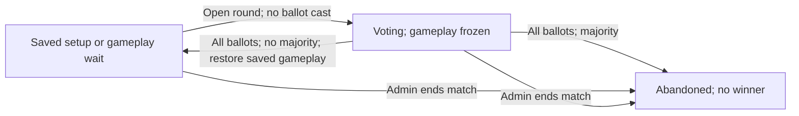

# Application Architecture

This document describes the current application architecture and the confirmed
backend expansion, marked as planned below. Game rules and mechanics belong in [GAME.md](GAME.md);
setup and usage instructions belong in [README.md](README.md). Where the reason for
a choice is not recorded, this document describes the choice without assigning a
motivation to it.

## Architectural goal

The backend is intended to be a presentation-layer-free game engine. It owns
game state and game behavior, and exposes them through web requests. Front ends
are separate clients of that API: a CLI, website, or local GUI should be able
to use the same backend without the engine knowing how the client presents the
game. HTTP controllers handle request and response translation; application
and game behavior belongs behind that boundary, without client-specific UI
logic.

## Service and API

The current implementation is a Go HTTP API; the complete game engine is still
in development. There is no client application in this repository. `main.go`
creates one Gin router and registers login, user, lobby, and Swagger routes.
Controllers bind JSON requests, call application services, and write HTTP
responses. Swagger documentation is generated from comments in the Go code
using Swaggo and served by the application.

The current API has both resource routes using IDs and action routes such as
`POST /user/getbyemail`. The planned match API below settles its own ID-based
resource and command routes; broader conventions for existing routes remain
tracked in [TODO.md](TODO.md).

All API JSON models explicitly use lowercase field names, including `userid`
for lobby membership requests. Login returns `{"token":"…"}`, and lobby lookup
returns `{"lobby":{"id":"…","name":"…","owner":"…","members":["…"]}}`.
User lookup returns `{"user":{"id":"…","name":"…","email":"…"}}`.
Registration rejects
capitalized or mixed-case variants of its `email`, `name`, and `password`
request keys with 400, while other request decoding remains case-insensitive.
Broader registration validation and response changes remain planned separately.

## Application layers

The implemented user, authentication, and lobby features are organized into
packages. The usual request path is:

`HTTP route → controller → service facade → service → repository → SQLite`

Controllers own HTTP concerns. Services perform application operations and
checks, such as verifying lobby ownership and membership. Repositories issue
SQL through `database/sql`. Models used for API responses can differ from
stored models; for example, the public user response omits the password hash
and authentication token.

Service facades establish a database transaction around each operation they
expose. They pass the transaction to services and repositories, and the shared
transaction helpers commit on success or roll back on error. This allows an
operation such as creating a lobby and adding its owner as a member to happen
within one transaction. Dependencies are assembled explicitly in `main.go`.

## Persistence and identity

Application state is stored in a local SQLite database. The database path comes
from `GRIM_DB`, and the connection enables SQLite foreign key enforcement. The
schema is defined in `sql/create-database.sql`; there is currently no migration
system. It includes users, lobbies, lobby membership, matches, and players,
although the HTTP application currently exposes only user and lobby operations.

Users and lobbies receive UUID string IDs generated by the application. Lobby
ownership is stored as an owner ID on the lobby, while membership is stored in
the `lobby_users` join table. The lobby creator is also inserted as a member.
Foreign keys connect lobbies and memberships to users and provide cascading
deletion for those relationships.

## Authentication and runtime

User creation hashes passwords with scrypt, using the normalized email address
as the salt. Login checks that hash, generates a random token, and stores the
token on the user record. Protected routes read the token from the
`Authorization` header, look up the associated user, and place that user in the
request context for the controller. The current code expects the token value
directly in the header. It does not parse a `Bearer` scheme or implement token
expiry.

The server reads `GRIM_DB` and `GRIM_SSL` from environment variables. It listens
on `localhost:8080` using TLS certificates at `GRIM_SSL/grim.crt` and
`GRIM_SSL/grim.key`. Some README examples use `http://`; the current startup
code uses TLS. The repository provides SQL scripts for initial database setup
and test data, while automated test coverage is sparse.

## Remaining technical work

The planned match backend below settles its permissions, migration approach,
and game API. Database backup and caching policies, broader conventions for
existing routes, and logging implementation remain backlog items in
[TODO.md](TODO.md).

## Planned match backend

This design is confirmed and has not yet been implemented. It targets the first
complete playable match; the delivery sequence and acceptance scenarios below
define the work. Existing application behavior is described above.

### Agreed scope

- A complete game with a small card catalogue is the first milestone.
- Matches are intended to finish in a single sitting, but response windows
  have no deadline. Players pass explicitly; elapsed time never implies a pass.
- The initial audience is a private playtest group of human players on one
  server, supporting multiple independent matches.
- Bots and spectators are deferred from this milestone.
- Matches support two through four players initially, including the distinct
  two-player rules and multiplayer Ring movement.
- Existing provisional game rules in [GAME.md](GAME.md) remain the baseline;
  content and rule gaps required by the selected catalogue must be settled.

### Lobby and match lifecycle

- A lobby exists only to set up and launch one match. It closes when the game
  begins; it is not reused for another match.
- Every participant must explicitly mark themselves ready. A roster change
  clears readiness for all participants.
- Only the lobby owner can launch, with two to four ready participants.
  Launch closes the lobby and creates a match in setup, including drafting.
- The server randomly orders participants into the initial Ring at launch
  and records that order. The first wizard in it takes the first turn once
  setup is complete.
- Lobby membership remains owner-managed. Each participant controls their
  own readiness; the former owner has no special gameplay authority after launch.
- Match views and commands are available only to authenticated participants.
- Members may leave before launch, clearing readiness. The owner must
  transfer ownership to another member or delete the open lobby before leaving.
- Lobby access is restricted to members. After launch, retain a closed lobby
  record pointing to its match and reject roster changes. Disconnecting
  preserves match participation; ending the match follows its vote/admin policy.

### Server state and client interaction

- The server owns and stores all authoritative match state and supports
  resumption, including unfinished exchanges and pending player choices.
- A required choice, such as selecting a card to discard, is recorded as an
  explicit waiting state. The match advances only after the client submits a
  valid choice from the required player.
- Response windows have no automatic timeout or pass.
- The initial API uses HTTP commands and polling for current player views.
  Views respect hidden information and identify who must act next; push
  delivery is deferred.
- Gameplay commands use `POST /match/:id/commands` with a typed payload,
  request ID, and expected revision. `GET /match/:id` returns the requesting
  participant's view. Readiness and launch remain lobby operations; launch
  must also be atomic and safe to retry.
- Voting uses separate endpoints and payloads: `POST /match/:id/votes` opens
  a round without casting a ballot; `POST /match/:id/votes/:roundId/ballots`
  submits a yes/no ballot. Opening a round and voting are separate requests,
  including for the initiator. Voting payloads do not use the gameplay command
  envelope, but retain request-ID, revision, authentication, and atomicity checks.
- Clients know the game rules and derive available actions, payments, and
  targets from the supplied state. The server validates every command and
  provides all randomization; it does not need to enumerate legal actions
  for the client.
- Match views include rules/catalogue versions, phase, Priority, public state,
  visible cards, and pile counts. A Required choice identifies its ID, deciding
  player, type, source, and necessary context, including persisted server-
  generated Research offers. Clients derive valid selections from that state
  and their rule knowledge.
- `GET /match/:id/catalogue` exposes the match's pinned card definitions to
  participants. Clients must support the match's stated rules version.
- The authoritative state is a versioned match document in SQLite, replaced
  transactionally after each accepted command. Membership and searchable
  metadata use ordinary tables. Schema version and match revision serve
  different purposes: decoding saved state and detecting stale commands.
- Each command supplies a unique request ID and its expected match revision.
  Retrying the same command returns its recorded outcome without repeating
  the action; conflicting commands are rejected so clients can refresh.
- The resulting state and command outcome are stored in one transaction.
  See [the persistence ADR](docs/adr/0001-match-snapshots-and-command-receipts.md).
- A Required choice may pause one logically uninterrupted Resolution across
  requests; it does not open a response window or allow other gameplay to
  interleave. Continuations are explicit saved data, rather than suspended
  functions or live connections.

### Engine and card definitions

- Implement game rules as a Go state machine independent of HTTP and SQLite.
  The application service authenticates requests, loads state, invokes the
  engine, and saves accepted transitions and their command outcomes.
- The engine performs automatic steps until it reaches a response window,
  Required choice, or match end.
- Store the server's private random-generator state with match state, and
  commit random outcomes with the command producing them. Randomness must
  be reproducible within a match and remain consistent across restarts;
  random-generator state and the initial seed are excluded from player views.
- Retain the initial seed and use diagnostic logs to reconstruct game flow
  when debugging. Do not build a complete replay store or replay API; ordinary
  operation and restart recovery use the authoritative snapshot.
- Diagnostic logs include accepted command inputs and choices, match ID,
  authenticated actor, revision, pinned versions, and random outcomes. They
  are operator-accessible and separate from player views; credentials and
  tokens are never logged.
- Do not provide a stored public player history or a player-history endpoint.
- Card designs use structured stats and references to typed Go effect
  handlers. Card instances have separate identities, ownership, locations,
  and changing state. No arbitrary card scripting language is required.
- Each match pins its catalogue and rules versions. Deployments must preserve
  behavior needed by unfinished matches or supply an explicit migration;
  loading an old match must not silently adopt changed rules or card values.
- See [the engine ADR](docs/adr/0002-independent-engine-and-typed-card-effects.md)
  and [the compatibility ADR](docs/adr/0003-pin-match-rules-and-catalogue.md).

### Administrative endings

- A server administrator has an authenticated `POST /admin/match/:id/end`
  endpoint to end a match, with an additional administrator authorization check.
- Add an `admin` column to the users table; administrator status is stored
  there rather than in a configured allowlist. Use `admin NOT NULL DEFAULT 0`.
- The server operator grants and revokes admin status through database updates
  initially; no admin-management API is required. Exclude admin status from
  public writable fields, preserve it in ordinary updates, and check the
  current stored flag on every admin request so revocation is immediate.
- Otherwise, ending the match requires a simple majority of remaining,
  non-eliminated players; during setup, all participants are eligible.
- Ballots cannot be changed. An open vote freezes all ordinary actions,
  Reactions, and other gameplay progression until every eligible player has
  submitted a ballot. There is no early conclusion when a majority appears.
- Voting rounds have no deadline. A round may begin while the game is waiting
  for input, regardless of Priority. Preserve its suspended gameplay state.
- Once all eligible ballots are submitted, a strict majority approves
  abandonment; a tie fails. An approved completed vote or admin command ends
  the match without awarding victory or resolving pending effects.
- A failed completed vote resumes the suspended gameplay state. A new vote
  can start only after the preceding vote concludes, with fresh ballots.
- A failed vote is closed; its support never carries forward or becomes
  sufficient automatically after elimination. A fresh abandonment vote is
  required.
- Eliminated players' ballots are invalidated and they do not participate
  further. Ordinary gameplay cannot cause elimination during a frozen vote.
- Opening a round never casts a ballot. Every eligible player submits a
  separate ballot payload through the ballot endpoint.
- Ballots are open but voter identities are not disclosed. Public views show
  aggregate yes/no counts, electorate size, and votes outstanding, without
  identifying who voted or who has not voted. The requesting player may see
  their own ballot status; internal actor-to-ballot associations stay private.
- The current round and its concluded outcome are part of current match state;
  a new round clears all prior support. There is no public voting history.
- Disconnecting alone does not end a match or produce automatic gameplay.
- Administrative authorization is distinct from lobby ownership and ordinary
  participant authentication; the current implementation has no admin column.

### Storage upgrades

- Introduce ordered incremental database migrations preserving existing
  accounts and lobbies, and explicit saved-document schema upgrades.
- An unsupported saved version produces a clear error without modifying the
  saved state. Deployments must account for pinned versions needed by
  unfinished matches; rules and catalogue changes cannot silently reinterpret
  those matches.

### Player information

The visibility clarification is recorded in [GAME.md](GAME.md).

| Information | Owning wizard | Other wizards |
| --- | --- | --- |
| Hand contents | Visible | Hidden |
| Draw-pile contents | Visible without order | Hidden |
| Draw-pile order | Hidden | Hidden |
| Discard-pile contents and order | Visible | Visible |
| Table state and revealed declarations | Visible | Visible |

Player views must apply these rules independently of authoritative storage.

### Separate game-content prerequisites

Completing unfinished game content is a separate design prerequisite for
accepting the complete-game milestone. The backend plan does not settle those
card texts or unfinished rules.

- Select the small catalogue and finish its victory-card ranks.
- Define its Spell and Artifact creation pools and remaining Research rules.
- Specify Attack Immunity duration and any other required unfinished rules.
- Settle the game draft procedure and victory challenge offers.

### Boundaries and stored state

- A `game` package owns rules, card designs and instances, state transitions,
  effect handlers, and viewer-specific projections. It has no HTTP or SQL
  dependencies.
- A `match` application package follows the existing controller/service/
  repository pattern for authentication, transactions, command receipts,
  participant views, catalogue access, and administrative termination.
- Extend `lobby` for member access, voluntary departure, controlled ownership
  transfer, readiness, and one-time launch. Fix the existing UpdateLobby
  authorization gap: the authenticated owner must authorize updates and
  ownership transfers; a body-supplied owner ID never establishes authority.
- Store match identity, membership, lifecycle/search metadata, the versioned
  snapshot, and command receipts in SQLite. Launch stores the closed-lobby link,
  participants, random initial Ring, initial snapshot, and launch receipt in
  one transaction.

The snapshot contains:

| Area | Stored information |
| --- | --- |
| Identity and compatibility | Match ID, schema version, rules version, catalogue version, revision, setup/playing/finished status |
| Players and Ring | Fixed user-to-wizard association, Ring order, elimination status, Integrity, progress on each victory path |
| Cards and zones | Instance/design IDs, ownership, ordered draw and discard piles, hands, assets, rumours, reserved Investigate draws, exhaustion and eligibility |
| Turn and effects | Active wizard, phase and step, turn counters, income/resources, used Attack, duration anchors, deferred expiry effects |
| Exchange | Original participants, surviving eligible players, Stack, commitments, payments, targets, Priority, consecutive passes, pending mandatory triggers |
| Required choices | Choice ID, deciding player, type, source/context, random offers, explicit continuation and instruction position |
| Randomness | Private initial seed and current generator state, interpreted with pinned random behavior |
| Administrative control | Current vote round and ballots, suspended gameplay state, final victory/draw/abandonment outcome |

The engine stops for ordinary player input as well as Priority, a Required
choice, a vote, or match end. A paused resolution cannot create an opportunity
for unrelated gameplay; a failed abandonment vote returns to that same pause.

Receipts are scoped to the match, authenticated actor, and request ID and
identify the submitted command. An identical accepted retry is recognized before
checking the current revision. Reusing an ID for different input is rejected.
Authorization is checked on every request. Invalid commands and transaction
failures leave authoritative state, revision, and random state unchanged.

### Delivery sequence

1. Add incremental migrations, admin storage/checks, lobby authorization,
   readiness/departure/transfer, match storage, and transactional one-time launch.
2. Build the independent state machine, card instances/zones, saved choices,
   reproducible random state, player projections, and command/retry protocol.
   Development fixtures may exercise these components without defining final
   card content or claiming that a complete game is playable.
3. Implement the documented phases, resources, Challenges, response exchanges,
   effect continuations, Ring movement, elimination, and victory checkpoints;
   gate unfinished mechanics on their separate game-design decisions.
4. Complete the separate catalogue/rules prerequisites and integrate their
   definitions and effect handlers, including the opening draft.
5. Verify complete two-, three-, and four-player matches, restart recovery,
   voting/admin endings, version compatibility, and the presentation-independent
   API. Client applications remain separate work.

### Acceptance scenarios

- Launch requires the owner, two to four members, and current readiness from
  each member. Roster changes clear readiness; retries create only one match.
- Every supported phase/action follows GAME.md, including nested Reactions,
  fixed response eligibility, costs paid at declaration, simultaneous triggers,
  and the distinct victory and Ring-removal checkpoints.
- Restart during a response window, random Research offer, required discard,
  deferred expiry, or open vote preserves exact state and required next input.
- A Required choice blocks unrelated gameplay and rejects invalid selections,
  wrong actors, and stale choice IDs. Failed votes resume the same choice.
- Voting uses separate opening/ballot payloads and endpoints. Opening a round
  casts no implicit ballot; each eligible player submits separately.
- Voting freezes gameplay, requires all eligible immutable ballots, treats a
  tie as failure, invalidates eliminated players' ballots, and starts fresh
  after a failed round. Admin termination works while gameplay is frozen.
- Anonymous public vote totals never expose other players' ballot identities
  or individual submission status, including through generic choice fields.
- Lost responses and competing requests never repeat a payment, consume an
  additional random result, or overwrite a newer match state.
- Projections show each owner's hand and unordered draw contents, every
  ordered discard pile, and public table information. Changing only draw order
  cannot change the player view; private seeds/state never appear in responses.
- Ordinary accounts cannot invoke admin endings or grant admin status;
  revocation takes effect on the next request. The lobby owner cannot override
  another wizard's gameplay decisions.
- Schema upgrades preserve accounts and lobbies. Saved matches retain pinned
  behavior or undergo explicit migration; unsupported state remains intact.
- A complete match reaches victory, a draw, or explicit abandonment using
  the approved small catalogue, with no fabricated rules filling content gaps.
